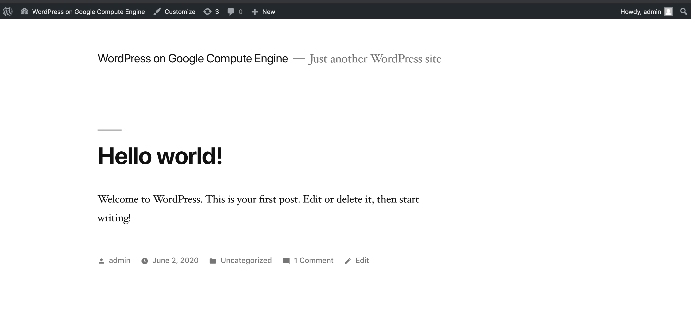

# wp-test-assignment

Local development environment to help developing and testing wordpress changes.



## initial setup

First up, define the username and password for your database:
```
DB_USERNAME=...
DB_PASSWORD=...
./prep-config.sh ${DB_USERNAME} ${DB_PASSWORD}
```

```
# start the system
docker-compose up

# reset the db
docker-compose exec -T database mysql -u${DB_USERNAME} -p${DB_PASSWORD} <<< 'drop database wordpress; create database wordpress;'

# import the db
HOSTNAME=your-online-ip
sed "s/${HOSTNAME}/localhost:8080/g" db.sql | docker-compose exec -T database mysql -u${DB_USERNAME} -p${DB_PASSWORD} wordpress
```

See below on how to download the db.

Once done, you can open the site at `http://localhost:8080`.

If developing in `wp-content/themes/test-theme` you will need to change the theme first.

## push changes

1. Setup git with `git init`
2. Then in vs code, for example, you can use UI to add changes and commit, or use `git add .` and `git commit -a -m "change comments"`
3. Finally use `git push`

## cleanup

```
docker-compose down -v
```

## GCP Anthos Wordpress

An easy online server option for Wordpress is the packaged [Anthos Wordpress](https://console.cloud.google.com/marketplace/details/google/wordpress) image available in GCP market.

Following sections relate to handlign server management together with this local repo

### add user

Create a private key:

```
ssh-keygen -t rsa -b 4096 -C "your.user@domain.com"
cat ~/.ssh/<key-name>.pub
```

Add this to the authorized keys using the GCP wordpress ssh web login console:

```
vi ~/.ssh/authorized_keys
```

Also, we need to add the user to the www-data group and give the group write permissions to allow changing the folder (there are [better solutions](http://michaelsoriano.com/solving-the-web-file-permissions-problem-once-and-for-all-repost/) for production servers)
```
sudo usermod <userrname> -g www-data
sudo chmod -R g+rwX /var/www
```

Then we can run ssh commands like:

```
ssh -i ~/.ssh/<key_name> <username>@<server-ip> 'ls /var/www/html'
```

### uploading theme

The Anthos machine is a bit tricky as the wordpress folder is owned by `www-data`, we must first upload to our user folder then move it over to `www` and finally change ownership. This is all encapsulated in this one command:

```
./upload-theme.sh <path-to-key-file> <username-and-ip>
# example
# ./upload-theme.sh ~/.ssh/id_rsa david@123.232.212.232
```

### downloading the db

open an ssl tunnel:
```
ssh -i ~/.ssh/<sshkey> -L localhost:3306:localhost:3306 username@external-ip
```

then dump the db:
```
mysqldump --host localhost --databases wordpress --user ${DB_USERNAME} -p \
    --hex-blob --single-transaction --set-gtid-purged=OFF \
    --default-character-set=utf8mb4 --protocol=tcp > db.sql
```